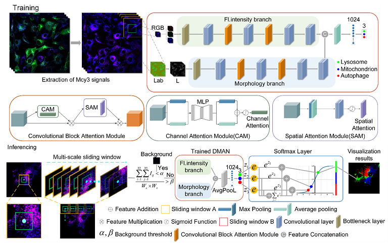

# DMAN
“An AI-assisted fluorescence microscopic system for screening mitophagy inducers by simultaneous analysis of mitophagic intermediates” in AI Framework-DMAN



# Software Requirements

## Hardware requirements

The package development version is tested on Linux operating systems.

Linux: Ubuntu 16.04

window: window 10 

CUDA/cudnn:10.1

## Python Dependencies
```
> - Python
> - PyTorch-cuda
> - torchvision
> - opencv
> - numpy
> - json
> - os
```
### Prepare dataset

Organize the folder as follows:

```
|-- dataset/
|   |-- train/
|   |   |-- class1
|   |   |   |-- 32
|   |   |   |-- 128
|   |   |-- class1
|   |   |   |-- 32
|   |   |   |-- 128
|   |   |-- ...
|   |-- test/
|   |   |-- image1.png
|   |   |-- image2.png
...
```
# Training and Evaluation example

> Training and evaluation are on a single GPU.

### Train with unsupervised domain adaptation 

```
python main.py
```
### Evaluation
Download our result checkpoint and test sample image from following: [URL](https://drive.google.com/drive/folders/1M9d9azwfhCnQ4wwZkUgq1_hRBSgx3JdW?usp=drive_link)
```
python test.py
```


